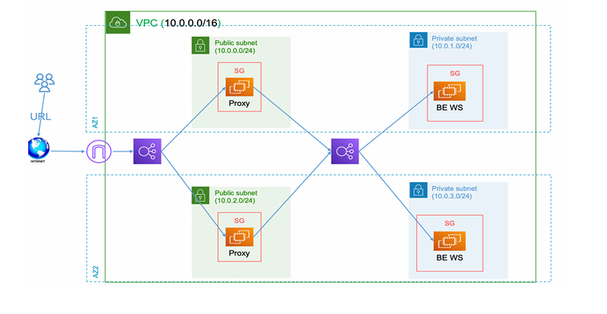
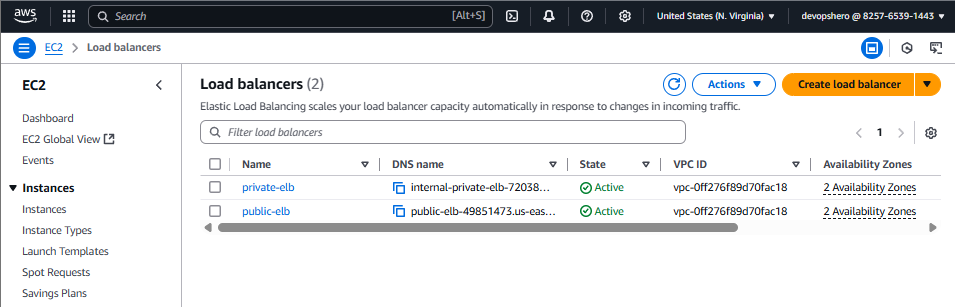
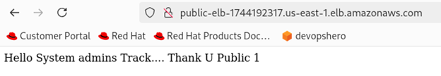
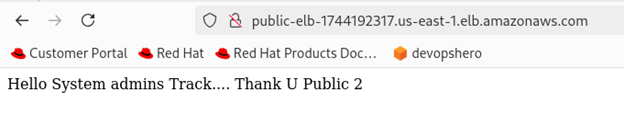
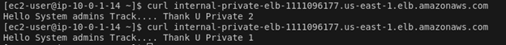

# Terraform_project_ITI

# Terraform AWS Infrastructure Project
This project implements a modular and scalable AWS infrastructure using **Terraform**, following Infrastructure as Code (IaC) best practices. It separates resources into reusable custom modules for **VPC**, **EC2 instances**, and **Load Balancers**, making the setup clean, maintainable, and production-ready.



### Key Features

- **VPC Architecture**
  - Custom VPC with public and private subnets
  - Internet Gateway and route tables
  - Proper tagging and availability zone distribution

- **EC2 Provisioning**
  - EC2 instances deployed in both public and private subnets
  - Apache or proxy installed using `remote-exec` provisioners
  - Public IPs saved to a local file `machineIPs.txt` using `local-exec`

- **Load Balancing**
  - A **public Application Load Balancer** routes traffic to public EC2 instances
  - An **internal Load Balancer** routes traffic to private EC2s

- **State Management**
  - **S3 backend** used to store Terraform state
  - **DynamoDB table** used for state locking and consistency

- **Dynamic AMI Retrieval**
  - Uses Terraform `data` source to fetch the latest Amazon Linux 2 AMI

- **Workspaces**
  - Terraform workspaces used to separate environments like `dev` and `prod`


## 🚀 Prerequisites

**1. Pre-create these AWS resources MANUALLY before proceeding:**
- **S3 Bucket** for Terraform state storage
- **DynamoDB Table** for state locking
- **AWS_KEY**  in my case it is name joeo


## 🛠️ Project Structure
[user1@localhost Terraform_project_ITI]$ tree
```bash
├── image.png
├── your-key.pem
├── machineIPs.txt
├── main.tf
├── modules
│   ├── compute
│   │   ├── main.tf
│   │   ├── outputs.tf
│   │   └── variables.tf
│   ├── load-balancing
│   │   ├── main.tf
│   │   ├── outputs.tf
│   │   └── variables.tf
│   ├── networking
│   │   ├── main.tf
│   │   ├── outputs.tf
│   │   └── variables.tf
│   └── security
│       ├── main.tf
│       ├── outputs.tf
│       └── variables.tf
├── outputs.tf
├── provider.tf
├── README.md
├── s3_dynamo.tf
├── terraform.tfvars
└── variables.tf
```

### 1. Clone the Repository
```bash
git clone https://github.com/youssefahmed8/Terraform_project_ITI.git
cd Terraform_project_ITI
```
### 2. Initialize Terraform
`terraform init`

### 3. Create a Workspace
`terraform workspace new dev`

### 4. Apply the Configuration
`terraform apply`

### 5. Output
Every Thing is Created From Vpc --> LoadBalancer 



Made a Bastion Host to test private Instances

